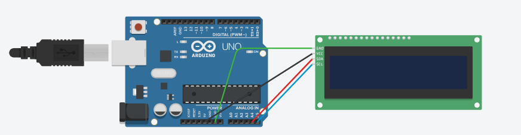

# SpotiFetch
An Arduino project that displays the currently playing spotify song and artist on an LCD display.


## Components Required
- Arduino Uno R3
- Jumper Cables
- Alphanumeric LCD (I've used a 16x2)
- I2C Serial Interface Adapter Module (To connect to the LCD module)

## Instructions
To get started, clone the repo into you computer.




Next, wire up your circuit according to the provided schematic. It is recommended to use a breadboard to securely connect the I2C module to the LCD display. This ensures a stable and reliable connection between the components.

Please refer to the schematic diagram or wiring diagram provided with the project documentation to correctly connect the components.

### Arduino IDE
To begin, connect your Arduino Uno board to your PC using a USB cable. Once connected, open the Arduino IDE on your PC.

To identify the appropriate communication port between your Arduino board and PC, follow these steps:

- Open the Arduino IDE.
- Navigate to Tools -> Port and make note of the COM port that your Arduino board is using. For example, it might be listed as COM7. We will use this port for data transmission in the Python code.

### I2C Address Checking
- To determine the I2C address of your LCD display (in this case, 0x3F), perform the following steps:
- In the Arduino IDE, navigate to File -> Examples -> Wire -> i2C_scanner.
- Upload the code to your Arduino board.
- Open the Serial Monitor in the Arduino IDE by going to Tools -> Serial Monitor.
- The Serial Monitor will display your LCD display's I2C address, which is typically either 0x3F or 0x27.
Make sure to update the I2C address in the [arduino_fetcher](arduino_fetcher.ino) file with the correct value you obtained.

Finally, upload the arduino_fetcher.ino code to your Arduino Uno board. With these steps completed, your hardware setup is now ready to proceed.


### Python
Open the python code in a code editor of your choice.
Update the COM port in the code, to ensure your python script and Arduino communicate on the same port.

## How it Works
I run the python script as an executeable, created using the pyinstaller package.
You can install it by running:
```python
pip install pyinstaller
```
followed by
```python
pyinstaller --onefile name_of_script.py 
```
The python script must keep running in the background to transmit information to the Arduino. Additionally, only run the executable after you have started playing a song, or this will throw an exception.

## Contributing
Contributions are welcome! If you have any suggestions, bug reports, or feature requests, please open an issue on the GitHub repository. If you would like to contribute code, feel free to fork the repository and submit a pull request.

## License
This project is licensed under the GNU General Public License. Feel free to use, modify, and distribute this code as per the terms of the license.
